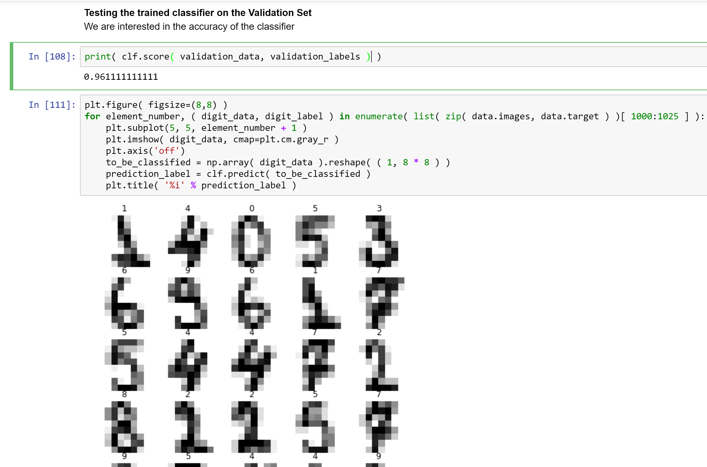

# Handwriting Recognition

In this notebook, we will use the Random Forest Classifier from the scikit learn library in Python to recognize digits from the grayscale image representations of their handwriting.

[References](https://www.youtube.com/watch?v=PO4hePKWIGQ)
